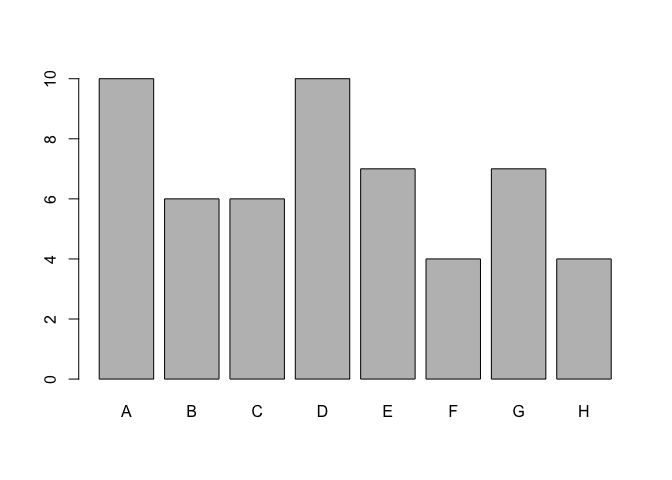

06 Qualitative Data
================
Peter Baumgartner
2017-03-02

-   [Load data set into memory](#load-data-set-into-memory)
-   [Frequency distribution](#frequency-distribution)
    -   [Find the number of painters belonging to each school in the data set `painters`.](#find-the-number-of-painters-belonging-to-each-school-in-the-data-set-painters.)
    -   [Find the frequency distribution of the composition scores in `painters`](#find-the-frequency-distribution-of-the-composition-scores-in-painters)
    -   [Find programmatically the school which has the most painters](#find-programmatically-the-school-which-has-the-most-painters)
-   [Relative frequencey distribution](#relative-frequencey-distribution)
    -   [Find the proportion of painters distributed among the schools](#find-the-proportion-of-painters-distributed-among-the-schools)
    -   [Find the relative frequency distribution of the composition scores](#find-the-relative-frequency-distribution-of-the-composition-scores)
-   [Bar Graph](#bar-graph)
    -   [Find the bar graph of the painter schools in the data set \`painters](#find-the-bar-graph-of-the-painter-schools-in-the-data-set-painters)

------------------------------------------------------------------------

    ## Loading required package: tidyverse

    ## Loading tidyverse: ggplot2
    ## Loading tidyverse: tibble
    ## Loading tidyverse: tidyr
    ## Loading tidyverse: readr
    ## Loading tidyverse: purrr
    ## Loading tidyverse: dplyr

    ## Conflicts with tidy packages ----------------------------------------------

    ## filter(): dplyr, stats
    ## lag():    dplyr, stats

    ## Loading required package: reshape2

    ## 
    ## Attaching package: 'reshape2'

    ## The following object is masked from 'package:tidyr':
    ## 
    ##     smiths

    ## Loading required package: pander

Yau, Chi. R Tutorial with Bayesian Statistics Using OpenBUGS (Kindle-Positionen524-525). Chi Yau. Kindle-Version.

Load data set into memory
=========================

``` r
> library(MASS)
> head(painters)
```

                  Composition Drawing Colour Expression School
    Da Udine               10       8     16          3      A
    Da Vinci               15      16      4         14      A
    Del Piombo              8      13     16          7      A
    Del Sarto              12      16      9          8      A
    Fr. Penni               0      15      8          0      A
    Guilio Romano          15      16      4         14      A

Frequency distribution
======================

The frequency distribution of a data variable is a summary of the data occurrence in a collection of non-overlapping categories.

Find the number of painters belonging to each school in the data set `painters`.
--------------------------------------------------------------------------------

We apply the `table` function to compute the frequency distribution of the School variable. `table` uses the cross-classifying factors to build a contingency table of the counts at each combination of factor levels.

``` r
> school <- painters$School
> school.freq <- table(school)
> school.freq
```

    school
     A  B  C  D  E  F  G  H 
    10  6  6 10  7  4  7  4 

We can apply the `cbind`function to print the result in column format.

``` r
> cbind(school.freq)
```

      school.freq
    A          10
    B           6
    C           6
    D          10
    E           7
    F           4
    G           7
    H           4

Find the frequency distribution of the composition scores in `painters`
-----------------------------------------------------------------------

``` r
> comp <- painters$Composition
> comp.freq <- table(comp)
> cbind(comp.freq)
```

       comp.freq
    0          1
    4          3
    5          1
    6          3
    8          6
    9          1
    10         6
    11         2
    12         4
    13         5
    14         3
    15        14
    16         2
    17         1
    18         2

Find programmatically the school which has the most painters
------------------------------------------------------------

``` r
> school <- painters$School
> school.freq <- table(school)
> school.freq.max <- max(school.freq)
> school.freq.max
```

    [1] 10

``` r
> L <- school.freq == school.freq.max
> L
```

    school
        A     B     C     D     E     F     G     H 
     TRUE FALSE FALSE  TRUE FALSE FALSE FALSE FALSE 

``` r
> x <- school.freq[L]
> x
```

    school
     A  D 
    10 10 

An alternative way is to use the function `which`. Which returns the positions of all TRUE indices.

``` r
> y = which(school.freq == school.freq.max)
> y
```

    A D 
    1 4 

``` r
> names(y)
```

    [1] "A" "D"

Note that the obvious function which.max is insufficient. It only gives the first school that has the most painters, instead of *every* school that has the most painters.

``` r
> which.max(school.freq)
```

    A 
    1 

Relative frequencey distribution
================================

In the data set `painters`, the relative frequency distribution of the School variable is a summary of the proportion of painters in each school.

Find the proportion of painters distributed among the schools
-------------------------------------------------------------

``` r
> school <- painters$School
> school.freq <- table(school)
> school.freq.prop <- school.freq / nrow(painters)
> school.freq.prop
```

    school
             A          B          C          D          E          F 
    0.18518519 0.11111111 0.11111111 0.18518519 0.12962963 0.07407407 
             G          H 
    0.12962963 0.07407407 

We can print with fewer digits and make it more readable by setting the digits option. The options() function allows the user to set and examine a variety of global options which affect the way in which R computes and displays its results. In the case of digits is the standard value 7

``` r
> opt = options(digits = 1) # "It is a suggestion only."
> school.freq.prop
```

    school
       A    B    C    D    E    F    G    H 
    0.19 0.11 0.11 0.19 0.13 0.07 0.13 0.07 

``` r
> options(opt)
```

In addition, we can apply the cbind function to print the percentage of painters in each school in column format. &gt; old = options(digits=3)

``` r
> opt <- options(digits = 3)
> cbind(school.freq.prop * 100)
```

       [,1]
    A 18.52
    B 11.11
    C 11.11
    D 18.52
    E 12.96
    F  7.41
    G 12.96
    H  7.41

``` r
> options(opt)
```

Find the relative frequency distribution of the composition scores
------------------------------------------------------------------

Find the relative frequency distribution of the composition scores in painters.

-   **Step 1:** Define a new variable comp that holds the composition scores.

``` r
> comp = painters$Composition
```

-   **Step 2:** Find the frequency distribution using the table function and save the result in another variable comp.freq

``` r
> comp.freq = table(comp)
```

-   **Step 3:** Find the relative frequency distribution by dividing comp.freq with the sample size.

``` r
> comp.rel.prop = comp.freq / nrow(painters)
> comp.rel.prop
```

    comp
             0          4          5          6          8          9 
    0.01851852 0.05555556 0.01851852 0.05555556 0.11111111 0.01851852 
            10         11         12         13         14         15 
    0.11111111 0.03703704 0.07407407 0.09259259 0.05555556 0.25925926 
            16         17         18 
    0.03703704 0.01851852 0.03703704 

``` r
> old = options(digits = 3)
> cbind(comp.rel.prop * 100)
```

        [,1]
    0   1.85
    4   5.56
    5   1.85
    6   5.56
    8  11.11
    9   1.85
    10 11.11
    11  3.70
    12  7.41
    13  9.26
    14  5.56
    15 25.93
    16  3.70
    17  1.85
    18  3.70

Bar Graph
=========

Find the bar graph of the painter schools in the data set \`painters
--------------------------------------------------------------------

``` r
> school <- painters$School
> school.freq <- table(school)
> barplot(school.freq)
```


